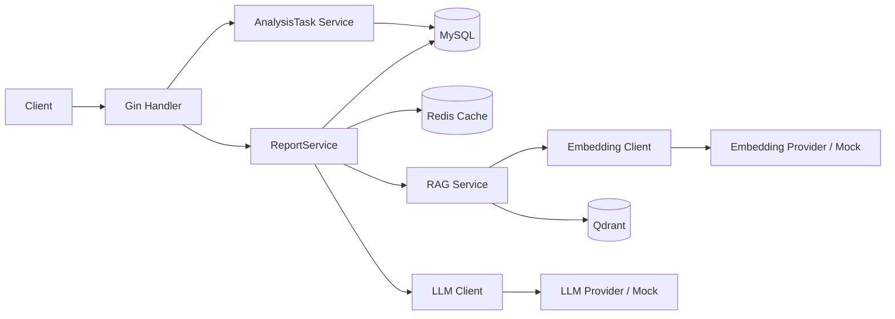
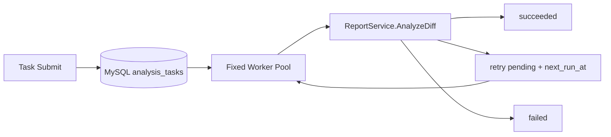

# PR-Guard-Agent

PR-Guard-Agent 是一个面向 Go 项目的 PR 变更风险分析后端：上传源码 ZIP 和 Git diff 后，通过 Go AST 语义分块、向量检索、RAG 与 LLM 生成经过校验的结构化风险报告。

## 项目背景

代码评审不仅需要看 diff，还需要理解被修改符号附近的实现、配置与依赖。该项目把源码版本、diff、语义代码块、向量索引和风险报告串成可重复执行的分析链路，同时提供同步接口和基于 MySQL 持久化队列的异步接口。系统输出是评审辅助信息，不替代人工 Review、安全审计或测试。

## 核心能力

- 上传并过滤 Go 项目 ZIP，计算文件内容哈希与 `code_version_hash`。
- 用 Go AST 按函数、方法、结构体、接口、常量和变量分块；非 Go 文本使用带重叠窗口分块。
- 为代码块生成 Embedding，并写入按项目版本过滤的 Qdrant Collection。
- 解析 unified Git diff、计算 `diff_hash`，检索相关文件、符号和上下文代码块。
- 构建 LLM Prompt，解析并校验结构化 JSON，限制 `related_files`、`related_symbols` 只能来自检索上下文。
- Redis 报告缓存、固定窗口限流、LLM 超时 Fallback。
- MySQL 持久化异步任务、幂等提交、固定 Worker Pool、`SKIP LOCKED` 领取、指数退避和 stale task 恢复。
- Request ID、Zap 结构化日志、任务列表、指标与 Worker Runtime 接口。

## 技术栈

- Go 1.25.4、Gin、GORM、Viper、Zap
- MySQL 8.0
- Redis 7.2
- Qdrant（gRPC）
- 可配置 Embedding/LLM HTTP Provider；开发环境内置确定性 Mock
- Docker Compose、PowerShell DAY21 验证脚本、`hey` 开发基线脚本

## 系统架构



异步执行链路：



## 同步 Analyze 流程

1. Handler 校验 `project_id`、`diff_id`、`top_k` 并传递 HTTP Context。
2. ReportService 校验项目、diff 归属关系，计算报告缓存 Key。
3. 命中非降级缓存时返回 `cached=true`。
4. 未命中时对 diff 生成 Embedding，并按 `project_id + code_version_hash` 过滤 Qdrant TopK。
5. 从 MySQL 加载并再次校验代码块归属，构造带行号和符号信息的 RAG 上下文。
6. 构建 Prompt，调用 LLM，解析 JSON 并做字段及来源白名单校验。
7. 正常报告写入 `risk_reports` 和 Redis；返回 `cached=false`。
8. LLM 超时、Provider 错误、非法 JSON 或报告校验失败时返回 `degraded=true` 的 Fallback。Fallback 的 `report_id=0`，不写 `risk_reports`，也不写报告缓存。

## 异步 AnalysisTask 流程

提交接口只验证参数和数据归属、计算任务 Key、写入或复用 `analysis_tasks`，不等待完整分析。Worker 使用独立于 HTTP Request 的 Context 执行 `ReportService.AnalyzeDiff`：

- `pending -> running -> succeeded`
- 可重试错误：`running -> pending`，写入 `next_run_at`
- 永久错误或重试耗尽：`running -> failed`

同一任务的并发提交依赖唯一 `task_key` 去重。失败任务只有在尚未耗尽尝试次数时才能被重新提交为 pending。

## Go AST 语义分块

`.go` 文件通过 `go/parser` 解析，按声明边界生成函数、方法（`Receiver.Method`）、struct、interface、const、var 块，并保留文件路径、符号类型、起止行、内容哈希和项目版本哈希。这样比固定字符窗口更能保持符号语义完整。

`.md/.yaml/.yml/.json/.sql/.lua/.mod/.sum` 使用 1500 rune 窗口、200 rune 重叠的文本分块。Mock Embedding 只用于链路测试，不能代表真实语义召回质量。

## RAG 检索

检索以完整 diff 文本作为查询，Embedding 后查询 Qdrant。Qdrant payload 包含 `project_id`、`code_version_hash`、`chunk_id`、文件、符号、行号和内容哈希；服务端必须同时过滤当前项目和当前源码版本。命中结果随后从 MySQL 加载原始代码块，并限制单块上下文最多 3000 rune。

LLM 只能把检索上下文中出现的文件和符号写入最终 `related_files`、`related_symbols`。这能减少无依据引用，但不能保证模型判断一定正确。

## Key 设计

Redis 报告缓存 Key：

```text
prguard:report:<project_id>:<code_version_hash>:<diff_hash>:topk:<top_k>
```

`top_k` 会改变上下文和模型输入，因此必须参与缓存隔离。缓存值保留原始生成时的 `cached=false`；命中后服务在响应副本上改为 `cached=true`，所以 Redis JSON 中 `cached=false` 是正常设计。

异步任务 Key 是以下长度消歧序列的 SHA-256：

```text
project_id : len(code_version_hash) : code_version_hash : len(diff_hash) : diff_hash : top_k
```

项目版本、diff 或 `top_k` 任一变化都会生成不同任务身份。

## Worker Pool、错误与恢复

- 固定 `worker_count` 个 Worker，避免每个请求创建无界 goroutine。
- MySQL 8 使用 `SELECT ... FOR UPDATE SKIP LOCKED` 在事务内领取一条到期 pending 任务。
- 领取时递增 `attempt_count`，状态写入均带 `id + status + worker_id + attempt_count` 条件，防止旧 Worker 覆盖新执行者。
- Embedding/Qdrant 超时或临时不可用、数据库临时错误、任务超时属于可重试错误；数据不存在、归属错误、非法参数等属于永久错误。
- 重试使用指数退避、最大延迟和 jitter；达到 `max_attempts` 后记为 `retry_exhausted`。
- 启动时恢复超过 `stale_after_seconds` 的 running 任务：未耗尽则重新排期，已耗尽则 failed。
- 关闭时先停止领取任务，并给运行中 Worker 留出受限等待时间；HTTP Server 使用 `Shutdown` 优雅退出。

## 日志、限流与可观测性

Request ID 中间件接收或生成 `X-Request-ID`，访问日志与分析/任务日志使用 Zap 字段记录请求、项目、diff、task、worker、状态和耗时。日志不记录完整源码、diff、Prompt、Authorization 或 API Key。

Analyze 与任务提交使用 Redis Lua 固定窗口限流，单次脚本原子执行 `INCR + EXPIRE + TTL`。当 `fail_open=true` 且 Redis 失败时，请求继续执行并写 `rate_limit_redis_error` Warn 日志。

Ops 提供分页任务列表、队列/窗口指标和进程内 Worker Runtime。任务列表不返回 `result_json` 或内部任务 Key；Runtime Snapshot 返回副本。当前 Ops 路由没有鉴权，只建议在开发环境或受控内网使用，不能直接暴露到公网。

## 项目目录

```text
cmd/                    服务入口与优雅关闭
configs/                运行配置与安全占位示例
internal/config/        配置加载和校验
internal/handler/       Gin Handler
internal/middleware/    Request ID、日志、Recovery、限流
internal/model/         GORM 模型
internal/repository/    MySQL 数据访问与任务领取
internal/service/       上传、索引、RAG、报告、任务与 Ops 服务
internal/taskerror/     错误分类和退避策略
internal/worker/        Worker Pool 与 Runtime Registry
pkg/cache/              Redis 报告缓存
pkg/chunker/            AST/文本分块
pkg/embedding/          Embedding Client
pkg/llm/                Prompt、LLM Client、报告校验
pkg/parser/             ZIP 过滤与 diff 解析
pkg/vector/             Qdrant Client
scripts/                联调、故障、缓存、异步与压测脚本
docs/                   测试、排错和面试复盘文档
```

## 环境要求与启动

- Go 1.25.4（以 `go.mod` 为准）
- Docker Desktop / Docker Engine + Compose
- PowerShell 5.1+ 或 PowerShell 7+
- 可选：`hey`，仅用于开发环境压测；脚本不会自动安装
- Race 检测需要支持 CGO 的 Go 工具链和 C 编译器

设置本地 MySQL 密码。不要把真实密码写入仓库：

```powershell
$env:PRGUARD_MYSQL_PASSWORD = "<LOCAL_MYSQL_PASSWORD>"
docker compose up -d
go run ./cmd
```

`docker-compose.yml` 会把该变量传给 MySQL；配置加载器会用同名 `PRGUARD_MYSQL_PASSWORD` 覆盖 `mysql.password`。其他配置也支持 `PRGUARD_` 前缀加下划线映射，例如 `PRGUARD_LLM_API_KEY`、`PRGUARD_REDIS_PASSWORD`。

首次启动会执行 GORM AutoMigrate，模型包括 `Project`、`ProjectFile`、`CodeChunk`、`DiffRecord`、`RiskReport` 和 `AnalysisTask`。生产或共享环境应使用受控迁移流程，不应只依赖 AutoMigrate。

完整配置参考 [configs/config.example.yaml](configs/config.example.yaml)。Mock 是默认开发 Provider；接入真实 Provider 时需配置 `base_url`、`api_key`、`model`、维度与超时，并保证 Embedding 维度和 Qdrant Collection 一致。

## API 列表

| Method | Path | 说明 |
|---|---|---|
| GET | `/health` | 进程健康检查 |
| POST | `/projects/upload` | 上传 ZIP，字段 `project_name`、`file` |
| POST | `/projects/:id/chunks/ast` | 兼容的 AST 分块接口 |
| POST | `/projects/:id/index` | 分块、Embedding、Qdrant Upsert |
| POST | `/projects/:id/diffs` | 上传 `.diff/.patch` 或 `diff_text` |
| POST | `/projects/:id/diffs/:diff_id/retrieve?top_k=5` | RAG 检索 |
| POST | `/projects/:id/diffs/:diff_id/analyze?top_k=5` | 同步风险分析 |
| POST | `/projects/:id/diffs/:diff_id/analysis-tasks?top_k=5` | 提交异步任务 |
| GET | `/analysis-tasks/:id` | 查询任务与终态结果 |
| GET | `/ops/analysis-tasks` | Ops 任务列表与过滤 |
| GET | `/ops/analysis-tasks/metrics?window_hours=24` | 队列与窗口指标 |
| GET | `/ops/workers` | Worker Runtime |
| POST | `/embedding/test` | Embedding 开发测试 |
| POST | `/vector/collection/init` | 初始化 Qdrant Collection |
| POST | `/vector/test/upsert` | 向量开发测试 |
| POST | `/vector/test/search?top_k=5` | 向量搜索开发测试 |
| POST | `/llm/risk/test` | LLM 结构化报告开发测试 |

`/vectoe/collection/init` 是当前代码保留的拼写兼容路由，不建议新调用方使用。

## 端到端使用流程

1. 上传项目 ZIP，记录 `project_id`。ZIP 最大 20 MiB；仅保留白名单扩展名，并跳过 `.git`、`vendor`、`node_modules` 等目录。ZIP 条目会拒绝绝对路径、`..`、盘符，并再次校验落盘路径位于目标目录内。
2. 调用 `/projects/:id/index`，确认 Chunk、Embedding 和 Qdrant Upsert 数量。
3. 上传 unified Git diff，记录 `diff_id`。diff 最大 50 MiB。
4. 调用 Retrieve 查看相关文件、符号和代码块。
5. 调用同步 Analyze 两次验证缓存，或提交异步任务并轮询。

已有项目与 diff 可直接运行：

```powershell
powershell -ExecutionPolicy Bypass -File .\scripts\day21-e2e.ps1 -ProjectID 6 -DiffID 5 -TopK 5
powershell -ExecutionPolicy Bypass -File .\scripts\day21-cache-test.ps1 -ProjectID 6 -DiffID 5
powershell -ExecutionPolicy Bypass -File .\scripts\day21-async-test.ps1 -ProjectID 6 -DiffID 5
```

故障脚本按场景单独运行，并遵守脚本输出的配置前置条件。会停容器的场景必须显式传 `-ConfirmDisruption`：

```powershell
powershell -ExecutionPolicy Bypass -File .\scripts\day21-fault-test.ps1 -Scenario invalid_json -ProjectID 6 -DiffID 5 -TopK 9
powershell -ExecutionPolicy Bypass -File .\scripts\day21-fault-test.ps1 -Scenario qdrant_unavailable -ConfirmDisruption -ProjectID 6 -DiffID 5 -TopK 10
```

## 测试命令

```powershell
go fmt ./...
go vet ./...
go test ./...
go test -race ./internal/worker/...
```

2026-07-17 的 DAY21 实测记录见 [docs/testing-report.md](docs/testing-report.md)。该记录区分通过、失败和“需要人工验证”，并保留 Mock 测试的适用边界。

### 2026-07-17 DAY21 实测摘要

- `go fmt ./...`、`go vet ./...`、`go test ./...` 真实执行通过。
- `go test -race ./internal/worker/...` 未能运行测试：当前 Windows 环境缺少 GCC，报错 `cgo: C compiler "gcc" not found`，不记为通过。
- project_id=6、diff_id=5 的 Retrieve、同步 Analyze、缓存隔离、异步幂等、Worker 并发、Fallback、限流、Redis fail-open、重试成功/耗尽、stale recovery 和 Ops 接口均按记录通过。
- 新上传的 project_id=8 在重复 Index 后出现 Retrieve HTTP 500：数据库 Chunk ID 已重建，但 Qdrant 中旧向量点仍可被召回，导致 `code_chunk not found: 542`。这是本次实测发现、尚未在 DAY21 范围内改动的已知问题。
- 自动化环境无法安全地向独立 Windows 服务进程发送 Ctrl+C 且保证不影响宿主进程，优雅关闭时序标记为“需要人工验证”；代码路径和日志字段检查不能代替该项动态验证。

## 开发环境压测

压测脚本只用于 Mock Provider、Analyze 缓存命中和开发环境基础接口，不对真实 LLM API 做高并发测试：

```powershell
powershell -ExecutionPolicy Bypass -File .\scripts\day21-benchmark.ps1 `
  -ProjectID 6 -DiffID 5 -Requests 200 -Concurrency 10 -ConfirmPrepared
```

脚本验证缓存预热并调用本机 `hey`。2026-07-17 已按接口分别执行真实基线：`GET /health`（1000/50）、缓存命中 Analyze（200/10）、任务查询（500/20）、Worker Runtime（500/20）、Ops Metrics（200/10），五组均为 HTTP 200、失败数 0。完整 RPS、平均延迟、P50/P90/P95/P99、环境与命令见 [docs/benchmark-results.md](docs/benchmark-results.md)。这些数字只代表该次 Mock + 缓存命中的本地开发环境。

## 常见问题

- 第一次 Analyze 已是 `cached=true`：旧缓存仍存在，先运行限定项目的缓存脚本，不要默认 `FLUSHDB`。
- Retrieve 命中 `go.sum` 等低价值块：Mock Embedding 只验证链路；真实召回需使用合适模型并评估数据。
- diff 解析失败：确保是包含 `diff --git` 和 `@@` hunk 的 unified diff，并用 UTF-8 保存。
- Ops 返回 404：检查 `ops.enabled=true` 并重启服务。
- 异步任务一直 pending：检查 Worker 是否启用、`next_run_at`、Qdrant/Embedding 状态及 `/ops/workers`。
- Redis Key 存在不等于某次请求命中：以该次 HTTP 响应的 `cached` 字段和对应请求日志为准。

更多检查命令和修复方式见 [docs/troubleshooting.md](docs/troubleshooting.md)。

## 安全说明与已知限制

- 仓库配置只保留空值或占位符；API Key、密码必须由本地配置管理或环境变量注入。
- 日志避免记录源码、diff、Prompt、Authorization 和密钥；客户端错误不返回内部堆栈、DSN、Redis 密码或 Provider 原始响应。
- 上传 ZIP 限制 20 MiB、diff 限制 50 MiB，且已有 ZIP 路径穿越校验。当前没有解压后总大小/压缩比配额，ZIP bomb 防护仍需增强。
- Ops 和开发测试接口没有鉴权，只适合开发或受控内网。
- 固定窗口限流是单实例共享 Redis 计数，但不是完整的租户配额系统。
- Mock Embedding/LLM 只用于确定性联调，不能证明真实语义质量、风险准确率或生产性能。
- 重复 Index 会重建 MySQL Chunk，但当前没有清理同项目版本的旧 Qdrant 点；旧点被召回时可能出现 `code_chunk not found`。在修复前避免对同一版本重复 Index，或在受控测试环境重建对应 Collection。
- `risk_reports.RawJSON` 保存正常 LLM 原始结构化输出，数据库权限和保留策略需要由部署环境控制。
- 当前服务依赖单个 MySQL、Redis、Qdrant 配置，未实现多租户隔离、分布式追踪、队列优先级或任务取消。

## 后续优化方向

- 为上传增加解压总量、单文件大小、压缩比和文件数限制。
- 为 Ops 与开发测试接口增加认证、授权和网络策略。
- 建立真实 Embedding/LLM 的离线检索评测与报告质量评测集。
- 增加 Prometheus/OpenTelemetry、告警和跨进程 Worker 心跳。
- 引入受控数据库迁移、数据保留与敏感输出治理。
- 在保持幂等语义的前提下增加任务取消、优先级和死信处理。
